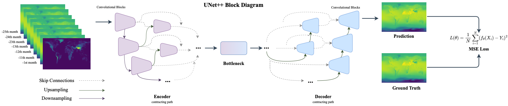
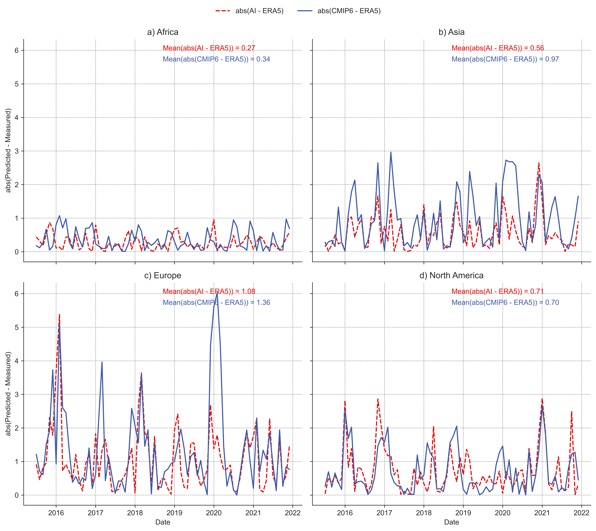
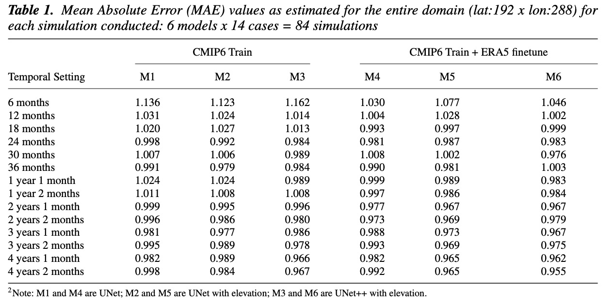

# climate-ai
This repository is a implementation of [Climate Model Driven Seasonal Forecasting Approach with Deep Learning](https://arxiv.org/abs/2302.10480), accepted to Environmental Data Sciences Journal. For further inquiries about the code, please contact busraasan2@gmail.com.

<p align="center">
  
</p>

## Requirements

To install requirements:

```setup
pip install -r requirements.txt
```

## Dataset

Even though CMIP6 and ERA5 is available online, our regridded data is not available yet. This section will be updated when it is ready.

## Training

In order to train the model, use the following command after configuring the args_parser.py file. In args_parser, one can set configurations such as what model, the number of lag years, predecessors/successors to use together with training parameters such as learning rate, weight decay etc.

```train
python cimp6_trainer_.py
```

## Evaluation

For the evaluation, the command below can be used. Same flags are available to training code is also available on this script.

```evaluate
python era_evaluate.py 
```

## Additional Information

In order to train models for monthly average output, command below can be used.

```train
python cimp6_trainer_average.py
```

## Results
Comparison against CMIP6 predictions.
<p align="center">
  
  
</p>

Experiments Benchmark
<p align="center">
  
</p>


